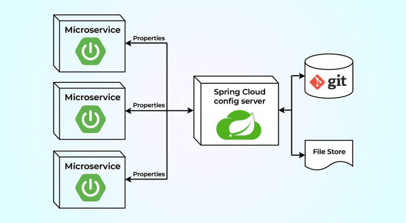

# Centralized Configuration with Spring Cloud Config Server

This branch introduces the **Spring Cloud Config Server**, which provides centralized external configuration management for all microservices across all environments.

## What is it?

The Config Server is a standalone service that manages external properties for applications across all environments. Instead of having configuration files (like `application.properties`) bundled inside each microservice's JAR, they are stored in a centralized, version-controlled repository (e.g., Git).



## Why Do We Need It?

Imagine you have 50 microservices running. Without a config server:
*   **Changing a config** (e.g., a database URL) requires repackaging and redeploying each affected service.
*   **Environment-specific configs** (dev, staging, prod) are hard to manage and prone to error.
*   **Secrets** like passwords are embedded in code, which is a security risk.

A Config Server solves this by:
1.  **Single Source of Truth:** All configuration is stored in one place (a Git repo).
2.  **Environment-Specific Configs:** Easily manage different properties for dev, QA, and prod.
3.  **Dynamic Refresh:** Change configuration on the fly without restarting services (using Spring Boot Actuator and `@RefreshScope`).
4.  **Encryption:** Encrypt sensitive information like passwords.

## Key Terminology

*   **Config Server:** The central server that serves configuration files to client applications.
*   **Config Client:** A microservice that fetches its configuration from the Config Server on startup.
*   **Backend Repository:** The version-controlled storage (e.g., Git, SVN, filesystem) where the configuration files are physically stored.
*   **Profile:** A Spring profile (e.g., `dev`, `prod`) that determines which configuration file is loaded (e.g., `user-service-dev.properties`).

## How It Works

1.  On startup, a **Config Client** (e.g., `user-service`) connects to the **Config Server**.
2.  The client identifies itself with its `spring.application.name` and active `profile`.
3.  The Config Server fetches the appropriate configuration file (e.g., `user-service.properties` or `user-service-dev.properties`) from the **Git repository** or file store.
4.  The Config Server sends this configuration back to the client.
5.  The client application boots with these external properties.

## Project Structure Update
```
hands-on-spring-microservices/services
├── config-server/ # NEW: The Spring Cloud Config Server
├── config-data/ # NEW: Local Git repo for config files (for demo)
├── api-gateway/
├── discovery-server/
├── user-service/
├── department-service/
└── pom.xml
```

## New Component: `config-server`

This is a standalone Spring Boot application that acts as the configuration server.

**Key Dependencies:**
```xml
    <dependency>
      <groupId>org.springframework.cloud</groupId>
      <artifactId>spring-cloud-config-server</artifactId>
    </dependency>
    <dependency>
      <groupId>org.springframework.cloud</groupId>
      <artifactId>spring-cloud-starter-netflix-eureka-client</artifactId>
    </dependency>
```

## Setting Up the Config Server
1. **Enable Config Server** by adding `@EnableConfigServer` in the main application class.
    ```java
    @SpringBootApplication
    @EnableConfigServer
    @EnableDiscoveryClient
    public class ConfigServerApplication {
         public static void main(String[] args) {
              SpringApplication.run(ConfigServerApplication.class, args);
         }
    }
    ```
2. **Set up the `application.yml`** to point to the backend local filesystem or Git repository.

   **Example `application.yml` for a local filesystem:**
    ```yaml
    spring:
      cloud:
         config:
            server:
              native:
                search-locations: classpath:/configs
   ```
   create a folder `configs` inside `resources` and add configuration files for each service and profile:
       *   `user-service.yml`
       *   `department-service.yml`
   for simplicity we're just using user-service and department-service. You can add more services as needed.

   **Example `application.yml` for a Git backend:**
   ```yaml
   spring:
     cloud:
       config:
         server:
           git:
             uri: <YOUR_GIT_REPO_URL>
             default-label: main
             username: <YOUR_GIT_USERNAME>
             password: <YOUR_GIT_USER_ACCESS_TOKEN>
   ```
   create a local Git repository (`config-data`) for simplicity. In a real scenario, this would be a remote repo like GitHub.
   1.  **Create the `config-data` directory** and initialize it as a Git repo.
   2.  **Create configuration files** for each service and profile inside this repo:
       *   `user-service.yml`
       *   `department-service.yml`

**Note:** Here application name is same as the file name. So for `user-service`, the config file is `user-service.yml`.

Now, we need to register config server with eureka server so that other services can discover it. Add the following to `application.yml` of config server.

```yaml
  eureka:
      client:
        service-url:
          defaultZone: http://localhost:8761/eureka/
      instance:
        prefer-ip-address: true
```

## Changes to Microservices (Config Clients)

To become **Config Clients**, each microservice needs to:
1.  **Add the `config-client` dependency.**
    ```xml
        <dependency>
          <groupId>org.springframework.cloud</groupId>
          <artifactId>spring-cloud-starter-config</artifactId>
        </dependency>
    ``` 
2.  Configure `application.yml`
    ```yaml
    spring:
      application:
        name: <YOUR_APPLICATION_NAME> # Must match the config file name 
      config:
        import: optional:configserver:http://localhost:8888 # URL of the Config Server
    ```
    * optional: — If the config server is unavailable, the app will still start (fail-fast is disabled).
    * configserver: — This is a special prefix for Spring Cloud to recognize the config server.
    * http://localhost:8888 — The address where your config server is running.

3.  remove any existing `application.properties` or `application.yml` files from the microservice, as they will now fetch configuration from the Config Server.

## How to Run

1.  **Start the foundational services first:**
    ```bash
    cd services/discovery-server
    ./mvnw spring-boot:run

    cd services/config-server
    ./mvnw spring-boot:run
    
    cd services/api-gateway
    ./mvnw spring-boot:run
    ```

2.  **Start a microservice (Config Client):**
    ```bash
    cd services/user-service
    ./mvnw spring-boot:run
    ```
    ```bash
    cd services/user-service
    ./mvnw spring-boot:run
    ```
3.  **Observe the logs:** Look for logs in the `user-service` startup indicating it is fetching configuration from the Config Server.

## Testing the Flow

* The `user-service` will no longer use its bundled `application.yml`.
* Instead, it will use the properties defined in the `configs/user-service.yml` file.
* Hit http://localhost:8888/user-service/default to see the service in action. You can also hit dev, qa, prod profiles by changing the URL to http://localhost:8088/user-service/dev, etc.

---

### Auto Refresh Configuration
We now have centralized config management. The next step is to enable **dynamic configuration refreshes without restarting** the services, using Spring Boot Actuator's `refresh` endpoint. This will be part of a future advanced configuration branch.
Add actuator dependency in parent [`pom.xml`](/pom.xml):
```xml
    <dependency>
      <groupId>org.springframework.boot</groupId>
      <artifactId>spring-boot-starter-actuator</artifactId>
    </dependency>
```
**Key Dependencies:**
```xml
    <dependency>
      <groupId>org.springframework.boot</groupId>
      <artifactId>spring-boot-starter-actuator</artifactId>
    </dependency>
```
update `application.yml` of config client as below:
```yaml
management:
  endpoints:
    web:
      exposure:
        include: refresh # Expose the refresh endpoint
```
Add `@RefreshScope` to any `@Component`, `@Service`, or `@RestController` where you want properties to be refreshed dynamically.

```java
@RestController
@RefreshScope
public class UserController {
    @Value("${some.config.property}")
    private String configProperty;
    // ...
}
```
Now, when you change a property in the config repository and commit it, you can trigger a refresh by sending a POST request to the `/actuator/refresh` endpoint of the microservice.

```bash
curl -X POST <APPLICATION_SERVER_URL>/actuator/refresh
```
This will refresh the configuration properties in that service without needing a restart.

## Resources
* [Spring Cloud Config Documentation](https://spring.io/projects/spring-cloud-config)
* [Encryption and Decryption](https://docs.spring.io/spring-cloud-config/reference/server/encryption-and-decryption.html)

## Next Step
* [Inter Service Communication with Feign Client](https://github.com/MdShohanurRahman/hands-on-spring-microservice/tree/open-feign)