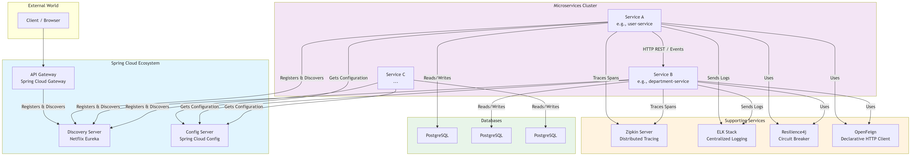

# Introduction to Microservices

## Overview & Problems They Solve

Microservices are an architectural style where an application is composed of small, independent services that communicate over well-defined APIs. Each service is focused on a single business capability.

They solve common problems found in **Monolithic architectures**:

| Aspect | Monolithic Application | Microservices Architecture |
| :--- | :--- | :--- |
| **Structure** | Single, unified codebase for all functions. | Collection of small, independent services. |
| **Development** | Tightly coupled, hard to manage with large teams. | Teams can develop, deploy, and scale services independently. |
| **Deployment** | A small change requires redeploying the entire application. | Services can be deployed independently. |
| **Scaling** | You must scale the entire application, even if only one part is slow. | Only the bottleneck service needs to be scaled. |
| **Technology** | Usually locked into one technology stack. | Each service can use a different technology (Polyglot). |

## Challenges

While powerful, microservices introduce new challenges:
*   **Distributed System Complexity:** Network latency, fault tolerance, and eventual consistency.
*   **Data Management:** Each service should have its own database, avoiding shared tables.
*   **Inter-service Communication:** Services need to find and talk to each other (service discovery).
*   **Testing & Monitoring:** Harder to test and debug a distributed system.

## Architecture Diagram


### **Diagram Breakdown:**

This diagram shows the final, target state of a mature Spring Microservices architecture.

1. **Client:** The end-user (web, mobile app) talks only to the **API Gateway**.

2. **API Gateway:** The single entry point. It routes requests to the correct microservice.

3. **Discovery Server:** The "phonebook" of the system. Every service registers here so others can find it.

4. **Config Server:** Provides centralized configuration for all services from a Git repository or files.

5. **Microservices:** The independent services (e.g., `user-service`, `department-service`). They:

    * Register with the Discovery Server.

    * Get their config from the Config Server.

    * Use **OpenFeign** to call other services.

    * Use **Resilience4j** for fault tolerance (e.g., retry, rate-limit, circuit breakers).

    * Send trace data to **Zipkin** for performance monitoring.

    * Send logs to the **ELK Stack** for centralized viewing.

6. **Databases:** Each service has its own private database (we are using PostgreSQL).

**Note:** We will build this step-by-step. This branch only includes the `user-service` and `department-service` without any of the advanced features like api gateway, service discovery or inter-service communication.

---

## Project Setup & Basic Services

This branch sets up the foundational Maven project structure and creates two independent microservices: `user-service` and `department-service`.

## Project Structure
```
hands-on-spring-microservices/service/
├── user-service/
│ ├── src/main/
│ │ ├── java/com/example/userservice/
│ │ └── resources/
│ │ ├── application.yml
│ │ └── ...
│ └── pom.xml
├── department-service/
│ ├── src/main/
│ │ ├── java/com/example/department_service/
│ │ └── resources/
│ │ ├── application.yml
│ │ └── ...
│ └── pom.xml
```

## Services Overview

1.  **user-service**
    *   **Port:** 8081
    *   **Function:** Simple REST API to manage User entities.
    *   **API:** `GET /users`, `POST /users`, `GET /users/{id}`

2.  **department-service**
    *   **Port:** 8082
    *   **Function:** Simple REST API to manage Department entities.
    *   **API:** `GET /departments`, `POST /departments`, `GET /departments/{id}`

## How to Run
1. **Run docker-compose:**
    ```bash
    docker-compose up -d
    ```
2. **Run user-service:**
    ```bash
    cd services/user-service
    ./mvnw spring-boot:run
    ```

3. **Run department-service:**
    *Open a new terminal window.*
    ```bash
    cd services/department-service
    ./mvnw spring-boot:run
    ```

4. **Test the APIs:**
    *   User Service: http://localhost:8081/api/v1/users
    *   Department Service: http://localhost:8082/api/v1/departments
 
## Next Step
*   [Service Discovery with Eureka](https://github.com/your-username/hands-on-spring-microservices/tree/discovery-server)
