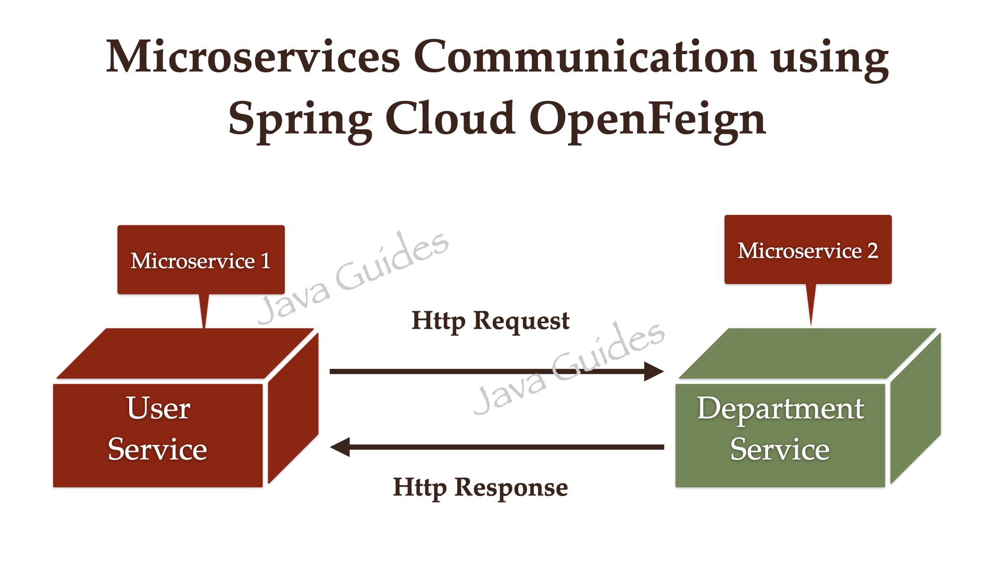

# Declarative REST Clients with OpenFeign

This branch introduces **OpenFeign**, a declarative web service client that dramatically simplifies making HTTP requests between microservices.

## What is OpenFeign?

OpenFeign is a library that makes writing web service clients easier. You define an interface and annotate it. Feign automatically translates these annotations into HTTP requests at runtime. It integrates seamlessly with service discovery (Eureka) and client-side load balancing.



## Why Do We Need It?

Without OpenFeign, to call another service (e.g., `user-service` calling `department-service`), you would have to use a low-level client like `RestTemplate` or `WebClient`. This involves:
*   **Boilerplate Code:** Writing URL building, request execution, and response parsing code every time.
*   **Manual Service Discovery:** You have to manually look up the service instance from Eureka using its `ApplicationServiceInstanceListSupplier`.
*   **Error Handling:** Manually handling timeouts, exceptions, and retries.

OpenFeign solves this by providing:
1.  **Declarative Style:** Define the HTTP API as a Java interface. No implementation needed.
2.  **Integration with Eureka:** Automatically resolves service names from Eureka into actual URLs.
3.  **Built-in Load Balancing:** Automatically distributes requests among available service instances (using Spring Cloud LoadBalancer).
4.  **Clean Code:** Eliminates all the boilerplate HTTP client code.

## How It Works

1.  You define an interface with methods annotated with Spring MVC annotations (`@RequestMapping`, `@GetMapping`, `@PostMapping`, etc.).
2.  You enable Feign clients in your application.
3.  At startup, Spring creates a dynamic proxy implementation of your interface.
4.  When you call a method on this interface, Feign:
    *   Contacts the **Discovery Client** (Eureka) to get the list of instances for the service name.
    *   Uses the **LoadBalancer** to pick an instance.
    *   Constructs the HTTP request based on the annotation.
    *   Makes the network call.
    *   Decodes the response and returns it.

## Project Changes

We will demonstrate this by enabling communication between our services. For example, when fetching a user, we might also want to get their department details.

**Use Case:** The `user-service` will use OpenFeign to call the `department-service`.

## How to Integrate OpenFeign

* Add Dependency to Microservices

    Add the OpenFeign starter to the `pom.xml` of any service that needs to call another service (e.g., `user-service`).
    ```xml
    <!-- In user-service/pom.xml -->
    <dependency>
        <groupId>org.springframework.cloud</groupId>
        <artifactId>spring-cloud-starter-openfeign</artifactId>
    </dependency>
    ```
* Enable Feign Clients

    In the main application class of the service that will use Feign (e.g., `UserServiceApplication`), add the `@EnableFeignClients` annotation.
    ```java
    @SpringBootApplication
    @EnableFeignClients
    public class UserServiceApplication {
        public static void main(String[] args) {
            SpringApplication.run(UserServiceApplication.class, args);
        }
    }
    ```
* Define a Feign Client Interface

    Create an interface that defines the methods to call the other service. Annotate it with `@FeignClient`, specifying the service name registered in Eureka.
    Example: [`DepartmentClient.java`](services/user-service/src/main/java/com/example/user_service/client/DepartmentClient.java) in `user-service`
    ```java
    @FeignClient(name = "department-service")
    public interface DepartmentClient {
        @GetMapping("/api/v1/departments/{id}")
        DepartmentDto getDepartmentById(@PathVariable("id") Long id);
    }
    ```
* Use the Feign Client in Your Service

    Inject the Feign client interface into your service class and use it to make calls to the other service.
    Example: [`UserService.java`](services/user-service/src/main/java/com/example/user_service/service/UserService.java) in `user-service`
    ```java
    @Service
    public class UserService {
        private final DepartmentClient departmentClient;
        
        public UserWithDepartmentDto getUserWithDepartment(Long userId) {
            UserDto userDto = getUserById(userId);
            DepartmentDto department = departmentClient.getDepartmentById(userDto.getDepartmentId());
            return new UserWithDepartmentDto(userDto, department);
    }
    }
    ```
   Example: [`UserController.java`](services/user-service/src/main/java/com/example/user_service/controller/UserController.java) in `user-service`
    ```java
    @RestController
    @RequestMapping("/api/v1/users")
    public class UserController {
        private final UserService userService;
        
        @GetMapping("/{id}/with-department")
        public ResponseEntity<UserWithDepartmentDto> getUserWithDepartment(@PathVariable Long id) {
            UserWithDepartmentDto userWithDepartment = userService.getUserWithDepartment(id);
            return ResponseEntity.ok(userWithDepartment);
        }
    }
    ```
## Testing the Integration
* Start all services: `discovery-server`, `config-server`, `api-gateway` `department-service`, and `user-service`.
* Call the new endpoint: GET http://localhost:8080/api/v1/users/1/with-department
* This request goes through the API Gateway to the `user-service`.
* The `user-service` uses OpenFeign to call the `department-service` internally.

## Resources
* [OpenFeign Documentation](https://docs.spring.io/spring-cloud-openfeign/docs/current/reference/html/)

## Next Step
Now that our services are communicating, we must make this communication resilient. A single slow or failing service can bring down the whole system. The next branch will introduce Resilience4j for circuit breaking, retries, and rate limiting to build fault-tolerant microservices.
* [Fault Tolerance with Resilience4j](https://github.com/MdShohanurRahman/hands-on-spring-microservice/tree/fault-tolerance)